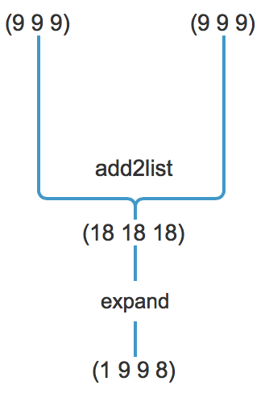

# 思路



## Code
```lisp
(define (add2list l1 l2)
        (cond ((and (null? l1) (not (null? l2))) (cons (car l2) (add2list l1 (cdr l2))))
              ((and (not (null? l1)) (null? l2)) (cons (car l1) (add2list (cdr l1) l2)))
              ((and (null? l1) (null? l2)) '())
              (else (cons (+ (car l1) (car l2)) (add2list (cdr l1) (cdr l2))))
        )
)
```

***

```lisp
(define (expand l flag)
    (cond 
        ((and (null? l) (= flag 0)) '())
        ((and (null? l) (not (= flag 0))) flag)
        (else 
            (cond ((> (+ flag (car l)) 9)  (cons (- (+ flag (car l)) 10) (expand  (cdr l) 1) ))
                  (else (cons (+ flag (car l)) (expand (cdr l) 0)))
            )
        )
    )
)
```

### Testcase

```
(expand (add2list (list 2 4 3) (list 5 6 4)) 0)

```

