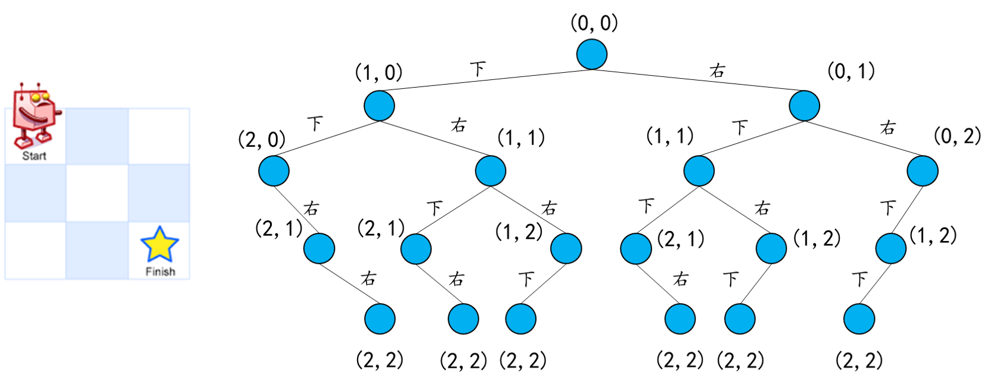
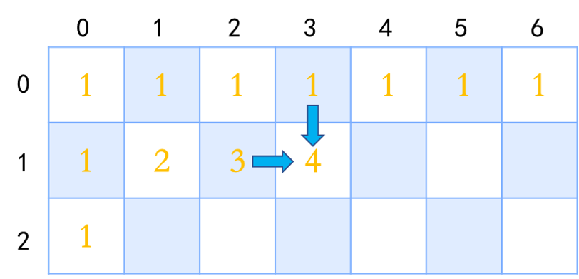
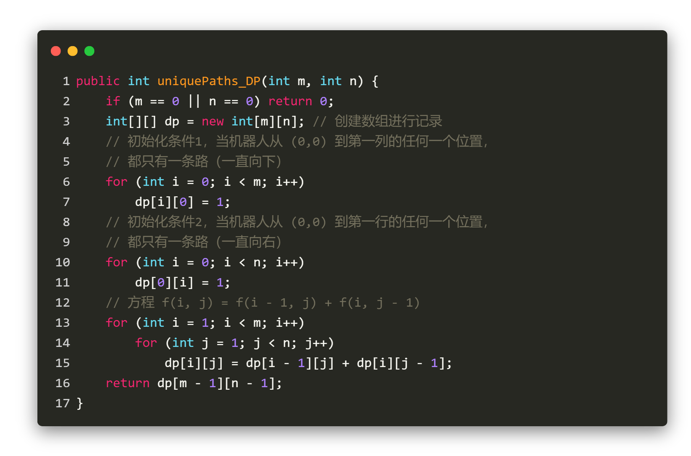
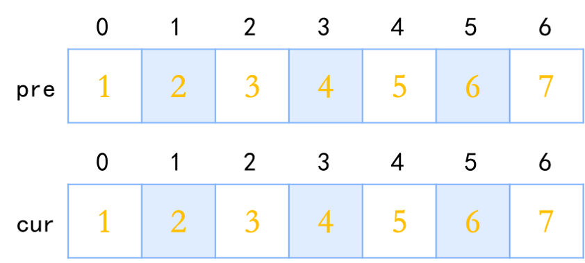
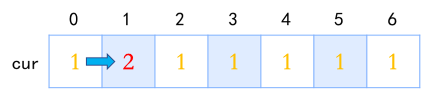

### 前言

最近刷 LeetCode 时，刷到了这样一道题：

    

看完题目以后，脑子里面出现了一棵树，为什么呢？因为他每次都会出现两种情况：要么向下，要么向右。如下图，对于一个 m = n = 3 的例子，就会有这样一颗树：

    

所以说，可以通过深度优先遍历 (Depth First Search, DFS) 搜索出所有路径（即该二叉树的叶子数）。话不多说，上代码！

    

一顿乱敲，So easy~ LeetCode一键提交，然而，万万没想到，时间超限！！！

    

显然，递归时间复杂度太高了，莫得办法，只能另辟蹊径。

### 动态规划

如下图所示，我们会发现，在计算机器人从 (0,0) 到达 (2,6) 有几条路径前，我们需要先计算出机器人从 (0,0) 分别到 (2,5) 和 (1,6) 的不同路径数，然后将两个路径数相加，便可以得到 (0,0) 到达 (2,6) 有不同路径，以此类推，不断分化出子问题。

    

也就是说，我们可以假设 f(i,j) 表示机器人从 (0,0) 到达 (i,j) 的不同路径数，便可以得到一个方程 f(i, j) = f(i - 1, j) + f(i, j - 1) 以及两个初始化条件(如下图)：
- f(0, j) = 1, 当机器人从 (0,0) 到第一列的任何一个位置，都只有一条路（一直向下）
- f(i, 0) = 1, 当机器人从 (0,0) 到第一行的任何一个位置，都只有一条路（一直向右）

    

然后，通过使用方程 f(i, j) = f(i - 1, j) + f(i, j - 1)，即可得出剩下的结果

    
    
    
    
    
    
    
    
    
    
    
    

代码如下：

    

提交结果显示效率 100%！

    

显然，这就是动态规划 (Dynamic Programming, DP) 的魅力。

我们发现，当一个问题满足以下两个条件的时候，我们就可以使用动态规划方法：

- 最优化原理（最优子结构性质）：也就是说，**我们可以通过子问题的最优解，推导出问题本身的最优解**。用专业一点的说法就是，一个最优化策略具有这样的性质，不论过去状态和决策如何，对前面的决策所形成的状态而言，余下的诸决策必须构成最优策略。简而言之，一个最优化策略的子策略总是最优的。
- 无后效性：也就是说，**如果在某个阶段上过程的状态已知，则从此阶段以后过程的发展变化仅与此阶段的状态有关，而与过程在此阶段以前的阶段所经历过的状态无关**

这两点也同时体现在了**状态转移方程** f(i, j) = f(i - 1, j) + f(i, j - 1) 之上，我们可以发现，在计算问题 f(i,j) 时，我们可以通过计算两个子问题 f(i - 1, j) 以及 f(i, j - 1) 的最优解得出问题本身的最优解 f(i,j)，与此同时，在计算当前状态下的 f(i,j) 时，我们只关心 f(i - 1,j) 以及 f(i, j - 1) 的状态，并不关心 这两个状态是如何得来的。

### 动态规划的关键目的

动态规划算法的关键在于解决冗余，这是动态规划算法的根本目的。动态规划实质上是一种以**空间换时间**的技术，它在实现的过程中，不得不存储产生过程中的各种状态，所以它的**空间复杂度要大于其他的算法**。选择动态规划算法是因为动态规划算法在空间上可以承受，而搜索算法在时间上却无法承受，所以我们舍空间而取时间。

通过程序对比递归和动态规划可以看出，递归的运行时间要比动态规划要慢很多很多倍！

    
    

动态规划的时间复杂度只有O(m*n)，空间复杂度O(m*n)

### 空间优化—O(2*n)

我们会发现，在使用动态规划的过程中，随着循环的进行，dp 数组是按照 i = 1,2,3... 逐行更新的，因此，我们不需要对 m*n 的 dp 数组进行维护，而是只需要定义两个分别为 当前行 i 和 上一行 i-1 的数组即可对 dp(i - 1, j) + dp(i, j - 1) 的数据进行维护。

    

图解如下：

    
    
    
    
    
    
    
    
    
    
    
    
    
    

代码如下：

    

### 空间优化—O(n)

我们又会发现，在使用 O(2*n) 空间复杂度的动态规划的时候，`cur[i]` 的 值 实际上是由 `pre[0]`至`pre[i]`的值叠加而来。因此，更进一步，我们只需要一个长度为 n 的数组，即可对可用数据进行维护。例如，在计算 `cur[6]` 的时候，实际上是计算 (pre[1] + pre[2] + ... + pre[5]) + pre[6].

图解如下：

    
    
    
    
    
    
    
    
    
    
    
    
    

代码如下：

    

**快乐学习多一点，Bug修复少一点**
**2020.7.26**