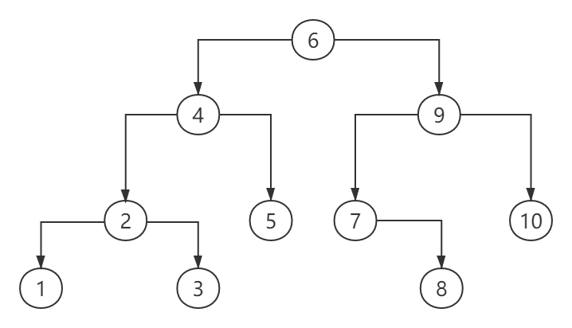
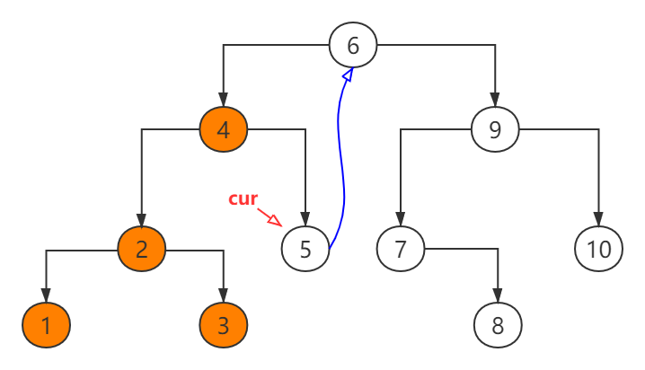

### 二叉树的遍历
对于二叉树的遍历，在数据结构中有`前序`、`中序`、`后序`遍历三种遍历方法，这三种方法通常采用递归或者迭代的方式实现。无论是递归还是迭代，在遍历过程中都需要用到**堆栈**保存信息，如果二叉树的高用h来表示，那么这三种遍历方式所需要的**空间复杂度为O(h)**，**时间复杂度也为O(h)**。

使用递归和迭代的二叉树遍历方法的缺点
- 如果二叉树的高度很大，例如搜索引擎把几十亿张网页按照权重来组成二叉树的话，那么二叉树的高度也要几十万左右，因此需要消耗大量的内存。

### Morris遍历算法

Morris二叉树遍历算法是时间复杂度为O(n)，空间复杂度为O(1)的遍历算法，他也有`前序`、`中序`、`后序`遍历三种遍历实现方式。

#### 前序节点

    

采用中序遍历的话，二叉树节点的访问情况如下:
1,2,3,4,5,6,7,8,9,10

给定某个节点，在中序遍历中，直接排在它前面的节点称之为该节点的前序节点，例如节点5的前序节点就是4。

在二叉树中如何查找一个节点的前序节点呢？

- 如果该节点有左孩子，从左孩子开始，
    - 如果左孩子有右节点，沿着右孩子指针一直走到底，得到的就是它的前序节点，例如节点6的左孩子是4，沿着节点4的右指针走到底，那就是节点5
    - 如果左孩子没有右节点，那么左孩子就是当前节点的前序节点
- 如果该节点没有左孩子
    - 如果当前节点是其父节点的左孩子，那么它没有前序节点，并且它自己是首节点，例如节点1
    - 如果当前节点是其父节点的右孩子，那么它的前序节点就是它的父节点，例如节点8的前序节点是7

PS. 前序节点的右指针一定是空的

#### Morris中序遍历

BST中算法实现：

- 指定`cur`指针初始指向`root`节点
- 当`cur指针的左子节点`为`NULL`时，说明在其左子树内没有前序节点，访问`cur指针`中的元素，`cur指针`指向`cur指针的右节点`
- 当`cur指针的左子节点`不为`NULL`时，找到`cur指针的前序节点`
    - 当`前序节点的右节点`为`NULL`时，将其指向`cur`，`cur`指向`cur的左节点`
    - 当`前序节点的右节点`不为`NULL`（为`cur指针`本身）时，将其置为`NULL`，访问`cur指针`中元素，`cur`指向`cur的右节点`
- 重复1，2步骤，直到`cur指针`为`NULL`

Java实现代码:

    

实例展示：

- 指定`cur`指针初始指向`root`节点6

    

- 当`cur指针的左子节点`不为`NULL`(4)时，找到`cur指针的前序节点`(5)，当`前序节点的右节点`为`NULL`时，将其指向`cur`，`cur`指向`cur的左节点`(4)

    

- 当`cur指针的左子节点`不为`NULL`(2)时，找到`cur指针的前序节点`(3)，当`前序节点的右节点`为`NULL`时，将其指向`cur`，`cur`指向`cur的左节点`(2)

    

- 当`cur指针的左子节点`不为`NULL`(1)时，找到`cur指针的前序节点`(1)，当`前序节点的右节点`为`NULL`时，将其指向`cur`，`cur`指向`cur的左节点`(1)

    

- 当`cur指针的左子节点`为`NULL`时，说明在其左子树内没有前序节点，访问`cur指针`中的元素，`cur指针`指向`cur指针的右节点`(2)

    

- 当`cur指针的左子节点`不为`NULL`(1)时，找到`cur指针的前序节点`(1)，当`前序节点的右节点`不为`NULL`（为`cur指针`本身）时，将其置为`NULL`，访问`cur指针`中元素，`cur`指向`cur的右节点`(3)

    

- 当`cur指针的左子节点`为`NULL`时，说明在其左子树内没有前序节点，访问`cur指针`中的元素，`cur指针`指向`cur指针的右节点`(4)

    

- 当`cur指针的左子节点`不为`NULL`(2)时，找到`cur指针的前序节点`(3)，当`前序节点的右节点`不为`NULL`（为`cur指针`本身）时，将其置为`NULL`，访问`cur指针`中元素，`cur`指向`cur的右节点`(5)

    

- 当`cur指针的左子节点`为`NULL`时，说明在其左子树内没有前序节点，访问`cur指针`中的元素，`cur指针`指向`cur指针的右节点`(6)

    

- 当`cur指针的左子节点`不为`NULL`(4)时，找到`cur指针的前序节点`(5)，当`前序节点的右节点`不为`NULL`（为`cur指针`本身）时，将其置为`NULL`，访问`cur指针`中元素，`cur`指向`cur的右节点`(9)

    

- 当`cur指针的左子节点`不为`NULL`(7)时，找到`cur指针的前序节点`(8)，当`前序节点的右节点`为`NULL`时，将其指向`cur`，`cur`指向`cur的左节点`(7)

    

- 当`cur指针的左子节点`为`NULL`时，说明在其左子树内没有前序节点，访问`cur指针`中的元素，`cur指针`指向`cur指针的右节点`(8)

    

- 当`cur指针的左子节点`为`NULL`时，说明在其左子树内没有前序节点，访问`cur指针`中的元素，`cur指针`指向`cur指针的右节点`(9)

    

- 当`cur指针的左子节点`不为`NULL`(7)时，找到`cur指针的前序节点`(8)，当`前序节点的右节点`不为`NULL`（为`cur指针`本身）时，将其置为`NULL`，访问`cur指针`中元素，`cur`指向`cur的右节点`(10)

    

- 当`cur指针的左子节点`为`NULL`时，说明在其左子树内没有前序节点，访问`cur指针`中的元素，`cur指针`指向`cur指针的右节点`(NULL)

    

### 应用: LeetCode 99. 恢复二叉搜索树

    
    
    

